# DataBank: Sistema de Gestión Bancaria

Sistema que simula la operación interna de un banco (clientes, cuentas,
tarjetas, créditos, empleados y auditoría), desarrollado en Python 3
aplicando Programación Orientada a Objetos: herencia, polimorfismo,
encapsulamiento, manejo de excepciones y separación en paquetes por
responsabilidad. Incluye una interfaz gráfica (Tkinter) y persistencia
de datos en JSON.

---

## Tabla de contenido

- [Descripción del problema](#descripción-del-problema)
- [Cómo se abordó el problema](#cómo-se-abordó-el-problema)
- [Arquitectura y Estructura del Proyecto](#arquitectura-y-estructura-del-proyecto)
- [Diagrama de clases](#diagrama-de-clases)
- [Tecnologías y Conceptos Aplicados](#tecnologías-y-conceptos-aplicados)
- [Instalación y Ejecución](#instalación-y-ejecución)
  - [Opción A: Windows](#opción-a-windows)
  - [Opción B: Linux/ macOS](#opción-b-linux-macos)
- [Casos de Uso Demostrados](#casos-de-uso-demostrados)
- [Reglas de negocio principales](#reglas-de-negocio-principales)
- [Persistencia de datos](#persistencia-de-datos)
- [Solución de problemas comunes](#solución-de-problemas-comunes)
- [Equipo](#equipo)

---

## Descripción del problema

Un banco necesita un sistema que administre de forma centralizada toda
la información y las operaciones de su negocio:

1. **Clientes y cuentas**: Cada cliente puede tener distintos tipos de
   cuenta (ahorros, corriente, juvenil o empresarial) cada una con sus
   propias reglas de retiro, límites de transferencia y tasas. Sobre esas
   cuentas se pueden hacer depósitos, retiros y transferencias, emitir
   tarjetas débito/crédito, y solicitar y pagar créditos.
2. **Empleados y permisos**: No todos los empleados pueden hacer lo
   mismo. Un Director puede aprobar créditos grandes y crear otros
   empleados; un Analista solo puede ver reportes; un Logístico tiene
   funciones más limitadas. El sistema debe validar esos permisos en
   cada operación sensible (crear empleados, aprobar créditos, ver
   información confidencial, etc.).
3. **Trazabilidad**: Toda acción relevante (creación de empleados,
   bloqueos de cuenta, cambios de rol) debe quedar registrada en un
   historial de auditoría, y los datos de la operación del banco no se
   deben perder al cerrar el programa.

Con este proyecto se resuelve los tres puntos con un modelo de clases que
representa el dominio bancario real con una capa de servicios que aplica
las reglas de negocio y valida permisos, y contamos con una interfaz gráfica que
permite operar el banco sin tener que tocar código.

## Cómo se abordó el problema

Para cuestiones de simplificación, se separó el proyecto en dos grandes capas, cada una organizada como su
propio paquete de Python:

- **`models/`** son las clases que representan las "cosas" del banco:
  `Client`, `BankAccount` (y sus 4 variantes), `Card`, `Credit`,
  `Transaction`, `Employee` (y sus 4 roles), `Log`. En su mayoría son
  clases de datos con reglas propias de validación (por ejemplo, una
  `YoungAccount` no se puede crear si el cliente no tiene entre 13 y 20
  años), pero **no saben nada de permisos ni de cómo se relacionan entre
  sí a nivel de negocio**, esa lógica vive en la siguiente capa.
- **`services/`** aquí vive la lógica que orquesta el negocio:
  `ManageAccounts`, `ManageCards`, `ManageCredits`, `ManageEmployees`,
  `SearchObjects`, `ListObjects`, `ReportObjects`, `Analize`,
  `Notificate` y `AutenticateObjects`. Cada una se encarga de una
  responsabilidad puntual (crear cuentas, gestionar créditos, generar
  reportes, autenticar usuarios...), y todas reciben una referencia al
  `Bank` para poder validar permisos y modificar su estado. La clase
  `Bank` actúa como fachada: es el único punto de entrada real al
  sistema, y por dentro delega cada operación al servicio que le
  corresponde.
- **Factories** (`AccountFactory`, `EmployeeFactory`): centralizan la
  lógica de "cuál subclase concreta hay que construir" al reconstruir
  cuentas y empleados desde el archivo JSON guardado, para que
  `Bank.import_data_json()` no tenga que conocer los detalles de cada
  subclase.
- **Persistencia** (`Bank.to_dict()` / `export_data_json()` /
  `import_data_json()`): cada modelo sabe convertirse a
  diccionario (`to_dict()` / `from_dict()`), y `Bank` combina todos esos
  diccionarios en un único archivo `DataBank_data.json`. Y con esto, cerrar y
  volver a abrir el programa no borra la información.
- **Interfaz gráfica** (`app_final.py`): es la capa más externa, hecha
  con Tkinter. Solo se encarga de pedir datos al usuario y mostrar
  resultados; toda la lógica real vive en `models/` y `services/`, así
  que en teoría se podría reemplazar la GUI por una interfaz de consola
  sin tocar el resto del sistema.

Se permitió que cada integrante pudiera trabajar en su parte
(un tipo de cuenta, un servicio, una pantalla de la GUI) sin pisar el
código de los demás, y el programa completo se arma importando estas
piezas desde `main.py` o `app_final.py`.

---

## Arquitectura y Estructura del Proyecto

```text
Databank-proyecto-final/
├── main.py                          # Script de prueba/demo por consola de todas las funcionalidades
├── app_final.py                     # Interfaz gráfica (Tkinter) — punto de entrada de la aplicación
├── DataBank_data.json               # Datos persistidos del banco
├── models/
│   ├── __init__.py
│   ├── accounts/
│   │   ├── bank_account.py          # Clase base BankAccount
│   │   ├── savings_account.py       # SavingsAccount (cuenta de ahorros)
│   │   ├── checking_account.py      # CheckingAccount (cuenta corriente)
│   │   ├── young_account.py         # YoungAccount (cuenta juvenil)
│   │   ├── business_account.py      # BussinessAccount (cuenta empresarial)
│   │   ├── client.py                # Client
│   │   ├── card.py                  # Card
│   │   ├── credit.py                # Credit
│   │   └── transaction.py           # Transaction
│   ├── roles/
│   │   ├── employee.py              # Clase base Employee
│   │   ├── autenticatable_employee.py # AutenticatableEmployee (empleado con contraseña)
│   │   ├── director.py              # Director
│   │   ├── administrative.py        # Administrative
│   │   ├── analist.py               # Analist
│   │   ├── logistic.py              # Logistic
│   │   └── commercial_partner.py    # CommercialPartner
│   ├── autenticable_helper/
│   │   └── autenticatable_helper.py # AutenticatableHelper (comparación de contraseñas)
│   ├── exceptions/
│   │   ├── impossible_operation_exception.py
│   │   ├── insufficient_balance_exception.py
│   │   └── account_not_found_exception.py
│   └── Log/
│       └── log.py                   # Log (bitácora de operaciones)
├── services/
│   ├── __init__.py
│   ├── bank.py                      # Bank — fachada central del sistema
│   ├── account_factory.py           # AccountFactory
│   ├── employee_factory.py          # EmployeeFactory
│   ├── manage_accounts.py           # ManageAccounts
│   ├── manage_cards.py              # ManageCards
│   ├── manage_credits.py            # ManageCredits
│   ├── manage_employees.py          # ManageEmployees
│   ├── search.py                    # SearchObjects
│   ├── list_objects.py              # ListObjects
│   ├── report.py                    # ReportObjects
│   ├── analize.py                   # Analize (estadísticas y detección de anomalías)
│   ├── notificate.py                # Notificate
│   ├── autenticate.py               # AutenticateObjects
│   ├── bonus_admin.py               # BonusAdmin
│   ├── auditlog.py                  # AuditLog
│   ├── promotion_request.py         # PromotionRequest
│   └── salary_inc_req.py            # SalaryIncreaseRequest
└── *.png / *.jpeg                   # Íconos usados por la interfaz gráfica
```

## Diagrama de clases

El diagrama de clases se dividió en dos partes para que fuera legible
(el proyecto tiene 39 clases en total). La división sigue exactamente la
misma separación de paquetes del código: **Modelos** (`models/`) y
**Bank + Servicios** (`services/`).

### Diagrama 1/2 — Modelos de dominio

Cuentas, clientes, tarjetas, créditos, transacciones, empleados y
excepciones. Es autocontenido por lo que no depende de `Bank` para tener sentido.

```mermaid
classDiagram
    direction TB
    %% DIAGRAMA 1 / 2 — MODELOS DE DOMINIO  (carpeta models/)
    %% No incluye Bank ni los servicios: ver Diagrama 2/2.

    %% --- Excepciones (models/exceptions) ---
    class Exception {
        <<Python built-in>>
    }
    class AccountNotFoundException
    class ImpossibleOperationException {
        +str message
        +int codigo
        +__str__() str
    }
    class InsufficientBalanceException

    Exception <|-- AccountNotFoundException
    Exception <|-- ImpossibleOperationException
    Exception <|-- InsufficientBalanceException

    %% --- Autenticación (models/autenticable_helper) ---
    class AutenticatableHelper {
        +comparate_passwords(saved_password, written_password) bool
    }

    %% --- Roles / Empleados (models/roles) ---
    class Employee {
        +int total_employees$
        +str name
        -str __position
        -str __dni
        -float __salary
        +int experience
        +bool is_blocked
        +int failed_attempts
        +bool can_change_role
        +datetime locked_until
        +get_position() str
        +set_position(new_position)
        +get_dni() str
        +get_salary() float
        +set_salary(new_salary)
        +obtain_bonus() float
        +raise_salary()
        +can_approve_credit(amount) bool
        +can_modify_salary(employee, amount) bool
        +can_see_reports() bool
        +can_see_information() bool
        +can_approve_transfer(amount) bool
        +can_create_user() bool
        +can_delete_user() bool
        +can_raise_salary(employee) bool
        +percentage_increase() float
        +can_request_promotion() bool
        +to_dict() dict
    }

    class AutenticatableEmployee {
        -AutenticatableHelper _helper
        -str __password
        +datetime register_date
        +get_password() str
        +authenticate_user(new_password) bool
        +obtain_bonus() float
        +is_blocked() bool
        +to_dict() dict
    }

    class Director {
        +str department
        +obtain_bonus() float
        +can_approve_credit(amount) bool
        +can_modify_salary(employee, amount) bool
        +can_see_reports() bool
        +can_see_information() bool
        +can_approve_transfer(amount) bool
        +can_create_user() bool
        +can_delete_user() bool
        +can_raise_salary(employee) bool
        +percentage_increase() float
        +to_dict() dict
    }

    class Administrative {
        +obtain_bonus() float
        +can_see_reports() bool
        +can_see_information() bool
        +can_create_user() bool
        +can_delete_user() bool
        +percentage_increase() float
    }

    class Analist {
        +obtain_bonus() float
        +can_see_reports() bool
        +percentage_increase() float
    }

    class Logistic {
        +obtain_bonus() float
        +percentage_increase() float
    }

    class CommercialPartner {
        -AutenticatableHelper _helper
        +str clave
        +autenticar_usuario(clave) bool
        +to_dict() dict
        +from_dict(data) CommercialPartner$
    }

    Employee <|-- AutenticatableEmployee
    AutenticatableEmployee <|-- Director
    AutenticatableEmployee <|-- Administrative
    AutenticatableEmployee <|-- Analist
    AutenticatableEmployee <|-- Logistic
    AutenticatableEmployee "1" *-- "1" AutenticatableHelper : _helper
    CommercialPartner "1" *-- "1" AutenticatableHelper : _helper

    %%  Auditoría de actividad (models/Log) 
    class Log {
        +str id
        +datetime date
        +Employee employee
        +str action
        +bool status
        +str details
        +to_dict() dict
        +from_dict(data, employees) Log$
        +__str__() str
    }

    Log "many" o-- "1" Employee : employee

    %% Cuentas bancarias (models/accounts) 
    class BankAccount {
        +int account_count$
        +int bank_number
        +str account_number
        +Client client
        -float _balance
        +float interest_rate
        +float overdraft_limit
        +bool account_active
        +float commission_value
        +float transfer_limit
        -int __withdrawals_without_balance
        -int __transfers_without_balance
        +List~Transaction~ transactions
        +int max_transactions_per_minute
        +datetime creation_date
        +List~Card~ cards
        +datetime locked_until
        +int daily_withdrawal_limit
        +get_balance() float
        +get_withdrawals_without_balance() int
        +get_transfers_without_balance() int
        +get_min_balance() float
        +get_max_transactions_per_minute() int
        +has_blocked_card() bool
        +can_withdraw(amount) bool
        +daily_withdraws() list
        +check_transaction_limit()
        +withdraw(amount) bool
        +deposit(amount)
        +transfer(amount, target_account) float
        +show_history()
        +is_temporarily_locked() bool
        +set_withdrawals_without_balance(value)
        +set_transfers_without_balance(value)
        +to_dict() dict
        +__str__() str
    }

    class SavingsAccount {
        +float interest_rate = 0.5
        +int daily_withdrawal_limit = 6
        +float transfer_limit = 5000000
        +apply_interest_rate()
        +withdraw(amount) bool
        +get_max_transactions_per_minute() int
        +can_withdraw(amount) bool
        +to_dict() dict
    }

    class CheckingAccount {
        +float overdraft_limit = -500
        +float transfer_limit = 10000000
        +get_min_balance() float
        +withdraw(amount) bool
        +get_max_transactions_per_minute() int
        +can_withdraw(amount) bool
    }

    class YoungAccount {
        +int daily_withdrawal_limit = 5
        +float transfer_limit = 500000
        +can_withdraw(amount) bool
        +to_dict() dict
    }

    class BussinessAccount {
        +int nit
        +List~Client~ authorized_users
        +float overdraft_limit = -10000
        +int daily_withdrawal_limit = 100
        +add_authorized_user(new_user)
        +get_max_transactions_per_minute() int
        +can_withdraw(amount) bool
        +to_dict() dict
    }

    class Client {
        +str name
        +int dni
        +int age
        +str profession
        +List~Credit~ credits
        +bool is_blacklisted
        +str blacklist_reason
        +datetime registration_date
        +add_credit(credit)
        +to_dict() dict
        +from_dict(data) Client$
        +__str__() str
    }

    class Card {
        +str card_number
        +str cvv
        -str __pin
        +bool is_blocked
        +datetime expiration_date
        +BankAccount account
        +Client holder
        +bool is_credit_card
        +bool is_debit_card
        +str card_type
        +get_pin() str
        +set_pin(current_pin, new_pin)
        +is_expired() bool
        +to_dict() dict
        +from_dict(data, accounts) Card$
        +__str__() str
    }

    class Credit {
        +float amount
        +float interest_rate
        +int months
        +Client client
        +bool approved
        +float remaining_balance
        +str status
        +to_dict() dict
        +from_dict(data, client) Credit$
        +__str__() str
    }

    class Transaction {
        +str id
        +datetime date
        +str type
        +float amount
        +BankAccount origin_account
        +BankAccount destination_account
        +str description
        +to_dict() dict
        +from_dict(data, accounts) Transaction$
        +__str__() str
    }

    BankAccount <|-- SavingsAccount
    BankAccount <|-- CheckingAccount
    BankAccount <|-- YoungAccount
    BankAccount <|-- BussinessAccount

    BankAccount "many" o-- "1" Client : client
    BankAccount "1" *-- "many" Transaction : transactions
    BankAccount "1" *-- "many" Card : cards
    BussinessAccount "many" o-- "many" Client : authorized_users
    Card "many" o-- "1" Client : holder
    Client "1" *-- "many" Credit : credits
    Transaction "many" o-- "0..1" BankAccount : destination_account
```



### Diagrama 2/2 — Bank y capa de servicios

`Bank` que es la fachada central y los 15 servicios que operan sobre ella.
Las clases `Client`, `Employee`, `BankAccount`, `Transaction` y `Log`
aparecen aquí **simplificadas** (marcadas `<<ver Diagrama 1/2>>`), solo
para no perder las flechas de relación — su definición completa
(atributos y métodos) está en el Diagrama 1/2.

```mermaid
classDiagram
    direction TB

    %%
    %% DIAGRAMA 2 / 2 — BANK Y CAPA DE SERVICIOS  (carpeta services/)
    %% Las clases marcadas <<ver Diagrama 1/2>> están simplificadas

    %%  Clases "puente" con Modelos (versión resumida)
    class Client {
        <<ver Diagrama 1/2>>
    }
    class Employee {
        <<ver Diagrama 1/2>>
    }
    class BankAccount {
        <<ver Diagrama 1/2>>
    }
    class Transaction {
        <<ver Diagrama 1/2>>
    }
    class Log {
        <<ver Diagrama 1/2>>
    }

    %% Núcleo: Bank 
    class Bank {
        +str name
        +int bank_number
        -str __password
        +List~Client~ clients
        +List~Employee~ employees
        +List~BankAccount~ accounts
        +List~Transaction~ global_transactions
        +List~Log~ logs
        +BonusAdmin bonus_admin
        +float interest_rate
        +List~AuditLog~ audit_history
        +List~PromotionRequest~ promotion_requests
        +List~SalaryIncreaseRequest~ salary_requests
        +List audit_logs
        +get_password() str
        +set_password(new)
        +total_assets float
        +validate_permission(employee, action) bool
        +create_client(employee, client_data) Client
        +register_transaction(transaction)
        +get_account_history(account) list
        +get_client_history(client) list
        +get_global_transactions(employee) list
        +register_global_bonus()
        +get_total_bonus() float
        +sort_accounts_by_number() list
        +sort_accounts_by_balance() list
        +register_log(action, employee, status, details) Log
        +get_logs() list
        +export_accounts_json()
        +validate_transfer_limit(amount, limit) bool
        +temporary_account_lock(account, minutes) datetime
        +blacklist_client(employee, client, reason) bool
        +register_log_e(log_entry)
        +to_dict() dict
        +export_data_json() bool
        +import_data_json(filepath) bool
    }

    %% Datos auxiliares creados FUERA de Bank (agregación) 
    class BonusAdmin {
        -float __total_bonus
        +register(employee)
        +get_total_bonus() float
        +set_total_bonus(value)
        +to_dict() dict
        +from_dict(data) BonusAdmin$
    }

    class AuditLog {
        +str timestamp
        +str action_type
        +str operator_name
        +str target_name
        +str target_dni
        +str details
        +to_string() str
        +to_dict() dict
        +from_dict(data) AuditLog$
    }

    class PromotionRequest {
        +Employee employee
        +str reasons
        +to_dict() dict
        +from_dict(data, employees) PromotionRequest$
    }

    class SalaryIncreaseRequest {
        +Employee employee
        +str reasons
        +to_dict() dict
        +from_dict(data, employees) SalaryIncreaseRequest$
    }

    PromotionRequest "many" o-- "1" Employee : employee
    SalaryIncreaseRequest "many" o-- "1" Employee : employee

    %% --- Factories ---
    class AccountFactory {
        +from_dict(data, clients) BankAccount$
    }

    class EmployeeFactory {
        +from_dict(data) Employee$
    }

    AccountFactory ..> BankAccount : crea
    EmployeeFactory ..> Employee : crea

    %% --- Servicios de gestión (todos creados DENTRO de Bank.__init__) ---
    class SearchObjects {
        +Bank bank
        +search_client_by_dni(dni) Client
        +search_client_by_name(name) Client
        +search_employee_by_dni(dni) Employee
        +search_employee_by_name(name) Employee
        +search_account_by_number(number) BankAccount
        +search_account_by_bank(bank) list
        +promotion_history(employee) list
        +employee_activity_history(employee) list
        +employee_login_history(employee) list
        +filter_transactions_by_type(type) list
        +filter_transactions_by_amount(min_amount, max_amount) list
    }

    class ListObjects {
        +Bank bank
        +list_client(employee) list
        +list_accounts(employee) list
        +list_accounts_by_client(client) list
        +list_accounts_by_bank(bank_number) list
        +list_employees(employee) list
        +list_active_credits() list
        +list_cards() list
        +list_cards_by_client(client) list
    }

    class ManageAccounts {
        +Bank bank
        +create_account(employee, client, account_type) BankAccount
        +delete_account(employee, account) bool
        +change_account_status(employee, account) bool
        +close_account(employee, account) bool
        +apply_monthly_fee(employee, account, fee) float
    }

    class ManageCards {
        +Bank bank
        +create_card(account, pin, credit, debit) Card
        +block_card(card)
        +unblock_card(card)
        +validate_card(card) bool
        +change_card_pin(card, current_pin, new_pin)
    }

    class ManageCredits {
        +Bank bank
        +request_credit(client, amount, months) Credit
        +approve_credit(employee, client, credit) bool
        +reject_credit(client, credit) str
        +calculate_credit_interest(credit) float
        +calculate_monthly_installment(credit) float
        +pay_credit_installment(client, credit, amount) float
    }

    class ManageEmployees {
        +Bank bank
        +add_employee(employee, target) Employee
        +delete_employee(employee, target) bool
        +change_role(employee, target, new_role, department) Employee
        +approve_salary_increase(employee, target, amount) float
        +apply_salary_increase(employee, target) float
        +evaluate_promotion(director, employee) dict
        +approve_promotion(director, employee) bool
        +update_experience(employee, points) int
    }

    class Notificate {
        +Bank bank
        +send_notification(notification_type, message)
        +notify_account_blocked()
    }

    class Analize {
        +Bank bank
        +get_total_bank_money() float
        +get_total_transactions() int
        +detect_suspicious_operations() list
        +get_most_used_account_type() str
        +get_top_clients(n) list
        +classify_client(client) str
        +calculate_client_score(client) int
        +currency_conversion(amount, from_currency, to_currency, rates) float
        +detect_large_transactions(limit) list
        +detect_suspicious_logins(employee) bool
    }

    class ReportObjects {
        +Bank bank
        +generate_employee_report() list
        +generate_security_report() list
        +generate_credit_report() list
        +generate_clients_report() list
        +generate_accounts_report() list
        +generate_transactions_report() list
        +generate_financial_report() dict
    }

    class AutenticateObjects {
        +Bank bank
        +autenticate_user(employee, password) bool
        +verify_failed_attempt(employee)
        +block_employee(employee)
        +unblock_employee(employee)
    }

    %% Relaciones de Bank con sus datos (agregación: nacen afuera) 
    Bank "1" o-- "many" Client : clients
    Bank "1" o-- "many" Employee : employees
    Bank "1" o-- "many" BankAccount : accounts
    Bank "1" o-- "many" Transaction : global_transactions
    Bank "1" *-- "many" Log : logs
    Bank "1" o-- "1" BonusAdmin : bonus_admin
    Bank "1" o-- "many" AuditLog : audit_history
    Bank "1" o-- "many" PromotionRequest : promotion_requests
    Bank "1" o-- "many" SalaryIncreaseRequest : salary_requests

    %% Relaciones de Bank con sus servicios (composición: nacen adentro) 
    Bank "1" *-- "1" SearchObjects : search
    Bank "1" *-- "1" ListObjects : list_objects
    Bank "1" *-- "1" ManageAccounts : manage_accounts
    Bank "1" *-- "1" ManageCards : manage_cards
    Bank "1" *-- "1" ManageCredits : manage_credits
    Bank "1" *-- "1" ManageEmployees : manage_employees
    Bank "1" *-- "1" Notificate : notificate
    Bank "1" *-- "1" Analize : analize
    Bank "1" *-- "1" ReportObjects : report
    Bank "1" *-- "1" AutenticateObjects : autenticate
```


---

## Tecnologías y Conceptos Aplicados

- **Lenguaje:** Python 3.13.7+.
- **Interfaz gráfica:** Tkinter (incluido con Python) + Pillow (`PIL`)
  para el manejo de íconos.
- **Herencia y polimorfismo:** las 4 cuentas heredan de `BankAccount` y
  sobrescriben `can_withdraw()`, `get_max_transactions_per_minute()`,
  etc.; los 4 roles heredan de `AutenticatableEmployee` y sobrescriben
  los métodos `can_*` que determinan permisos, sin necesidad de
  `if/elif` por tipo en ningún otro lugar del código.
- **Encapsulamiento:** atributos sensibles como la contraseña
  (`__password`), el PIN de una tarjeta (`__pin`) o el saldo
  (`_balance`) están protegidos y solo se acceden mediante getters
  controlados.
- **Patrón Facade:** `Bank` centraliza el acceso a todos los servicios;
  el resto del programa (la GUI, `main.py`) solo interactúa con `Bank`,
  nunca directamente con `ManageAccounts` o `ManageCredits` por su
  cuenta.
- **Patrón Factory:** `AccountFactory` y `EmployeeFactory` encapsulan la
  decisión de qué subclase concreta instanciar al reconstruir datos
  desde el JSON.
- **Manejo de excepciones propias:** `ImpossibleOperationException`,
  `InsufficientBalanceException` y `AccountNotFoundException` se lanzan
  ante operaciones inválidas (saldo insuficiente, cuenta bloqueada,
  permiso denegado) en vez de dejar que el programa falle.
- **Persistencia estructurada:** cada clase implementa `to_dict()` /
  `from_dict()` propios, y `Bank` los combina para guardar y restaurar
  el estado completo del sistema en un solo archivo JSON.

---

## Instalación y Ejecución

Se necesita Python 3.13.7 o superior. La única dependencia externa
obligatoria es **Pillow** (para los íconos de la interfaz gráfica).

1. **Clonar el repositorio:**
   ```bash
   git clone https://github.com/laurajespm/Databank-proyecto-final
   ```

Dependiendo de qué sistema operativo se utilice se usa:

### Opción A: Windows

1. **Crear un entorno virtual** (para instalar dependencias sin afectar
   el resto de tu computador):
   ```bash
   python -m venv venv
   ```

2. **Activarlo:**
   ```powershell
   venv\Scripts\Activate.ps1
   ```

3. **Instalar dependencias:**
   ```bash
   pip install -r requirements.txt
   ```

4. **Ejecutar la interfaz gráfica:**
   ```bash
   python app_final.py
   ```

   O, si prefieres correr el script de demostración por consola:
   ```bash
   python main.py
   ```

### Opción B: Linux/ macOS

1. **Crear un entorno virtual:**
   ```bash
   python3 -m venv venv
   ```

2. **Activarlo:**
   ```bash
   source venv/bin/activate
   ```

3. **Instalar dependencias:**
   ```bash
   pip install -r requirements.txt
   ```

   > En algunas distribuciones de Linux, Tkinter no viene incluido con
   > Python y hay que instalarlo aparte con el gestor de paquetes del
   > sistema, por ejemplo: `sudo apt install python3-tk` (Debian/Ubuntu).

4. **Ejecutar la interfaz gráfica:**
   ```bash
   python3 app_final.py
   ```

   O, si prefieres correr el script de demostración por consola:
   ```bash
   python3 main.py
   ```

---

## Casos de Uso Demostrados

Al correr `app_final.py` (o revisar `main.py`), se pueden probar los
siguientes flujos:

1. **Registro de clientes y apertura de cuentas:** un empleado con
   permisos crea un cliente y le abre una cuenta de ahorros, corriente,
   juvenil o empresarial, cada una con sus propias reglas (por ejemplo,
   la cuenta juvenil exige que el cliente tenga entre 13 y 20 años).
2. **Operaciones financieras:** depósitos, retiros y transferencias
   entre cuentas, respetando límites de sobregiro, límite diario de
   retiros y límite de transacciones por minuto según el tipo de
   cuenta.
3. **Tarjetas:** emisión de tarjetas débito o crédito asociadas a una
   cuenta, bloqueo/desbloqueo y cambio de PIN.
4. **Créditos:** solicitud de un crédito, aprobación (solo si el
   empleado tiene permiso suficiente según el monto), rechazo con
   motivo, y pago de cuotas mensuales hasta saldarlo.
5. **Gestión de empleados:** contratación, cambio de rol, aumento de
   salario (manual o por porcentaje según el cargo) y evaluación de
   solicitudes de promoción según los años de experiencia.
6. **Bonificaciones:** cálculo del bono anual de cada empleado según su
   rol (Director 50%, Analista 20%, Administrativo 15%, Logística 30%
   del salario), acumulado en `BonusAdmin`.
7. **Reportes y análisis:** reportes de seguridad, créditos, clientes,
   cuentas y estado financiero global; detección de cuentas con
   operaciones sospechosas y clasificación de clientes (VIP,
   Preferencial, Básico) según su saldo.
8. **Persistencia:** al cerrar la aplicación, todo el estado del banco
   se guarda en `DataBank_data.json`; al volver a abrirla, se recupera
   automáticamente (ver sección siguiente).

## Reglas de negocio principales

**Límites de retiro/transacciones por tipo de cuenta:**

| Tipo de cuenta | Límite diario de retiros | Límite de transferencia | Transacciones/minuto |
|---|---|---|---|
| Ahorros | 6 | $5.000.000 | 2 |
| Corriente | — (sobregiro hasta -$500) | $10.000.000 | 15 |
| Juvenil | 5 | $500.000 | 100 (heredado) |
| Empresarial | 100 | $3.000.000 (heredado) | 10 |

**Un crédito es rechazado si:**
- El cliente supera los 65 años.
- El cliente ya tiene un crédito aprobado activo.
- El cliente tiene cuotas pendientes de otro crédito.
- El cliente tiene saldo negativo en alguna de sus cuentas.

**Un empleado puede aprobar un crédito solo si:**
- Es Director y el monto no supera $100.000 (los demás roles no pueden
  aprobar créditos).

**Una cuenta se bloquea temporalmente si:**
- Un empleado la bloquea explícitamente por un número de minutos
  determinado (`temporary_account_lock`), útil ante actividad
  sospechosa.

## Persistencia de datos

El sistema guarda **todo** el estado del banco (clientes con sus
créditos, empleados, cuentas con sus tarjetas y transacciones,
auditoría, solicitudes de promoción/aumento y el bono acumulado) en un
único archivo `DataBank_data.json`, mediante `Bank.to_dict()` /
`export_data_json()`.
 
Al iniciar `app_final.py`, si el archivo ya existe, se importa
automáticamente con `Bank.import_data_json()` **antes** de crear
cualquier dato nuevo (incluida la directora por defecto, que solo se
crea si no viene ya cargada desde el archivo). Esa importación solo
ocurre una vez, al arrancar la aplicación.
 
A partir de ahí, `export_data_json()` se vuelve a llamar
automáticamente después de prácticamente cada operación relevante
(crear un cliente, abrir una cuenta, aprobar un crédito, etc.), y
también al cerrar la ventana. Como la carga inicial trae todo lo que ya
existía y cada guardado posterior escribe el estado completo del banco
en ese momento (lo viejo que se cargó + lo nuevo de la sesión), el
resultado neto es que la información se acumula entre una sesión y
otra en vez de perderse.

## Solución de problemas comunes

- **`ModuleNotFoundError` al ejecutar `app_final.py` o `main.py`**:
  revisa que estés parado en la carpeta raíz del proyecto
  (`Databank_proyecto_final/`) y que el entorno virtual esté activado.
- **El programa no reconoce `python`**: en algunos sistemas el comando
  se llama `python3` en vez de `python`. Prueba `python3 app_final.py`.
  Esto pasa porque en Linux / Mac se requiere usar explícitamente la
  versión moderna con el comando `python3`; si solo se escribe
  `python`, en estos sistemas operativos podría no reconocerse o
  apuntar a una versión distinta, mientras que en Windows no hay
  problema al usar solamente `python`.
- **`ModuleNotFoundError: No module named 'PIL'`**: falta instalar
  Pillow. Ejecuta `pip install -r requirements.txt` con el entorno
  virtual activado.
- **`ModuleNotFoundError: No module named 'tkinter'` (Linux)**: Tkinter
  no viene incluido en algunas distribuciones; instálalo con
  `sudo apt install python3-tk` (Debian/Ubuntu) o el equivalente de tu
  distribución.
- **No se ven reflejados los cambios de una sesión anterior**: verifica
  que `DataBank_data.json` esté en la misma carpeta desde la que
  ejecutas el programa, y que la ventana anterior se haya cerrado con
  la X (el guardado automático se dispara al cerrar la ventana, no al
  matar el proceso desde la terminal).

## Equipo

Este proyecto fue desarrollado de forma colectiva por:

- [Laura Juliana Espinosa](https://github.com/laurajespm) 
- [Sofia Valentina Arboleda](https://github.com/Juan3301) 
- [Juan Esteban León](https://github.com/Arboleda08) 
